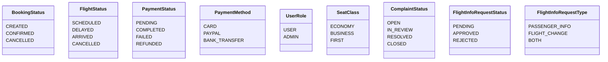
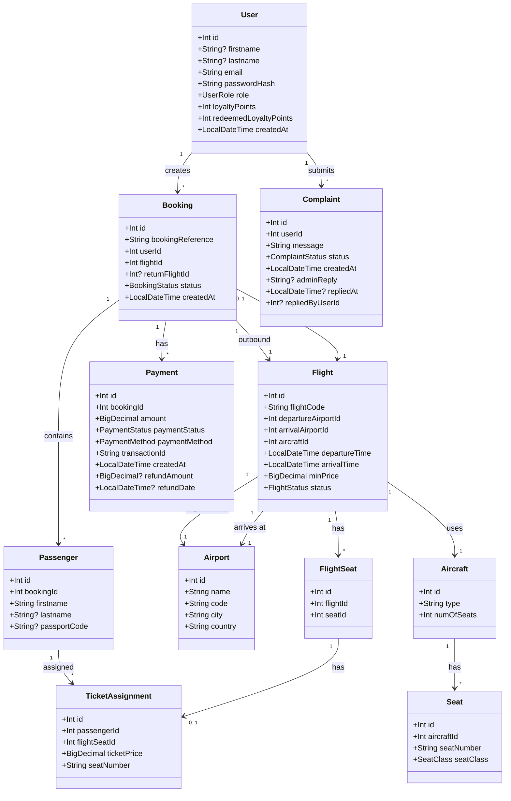
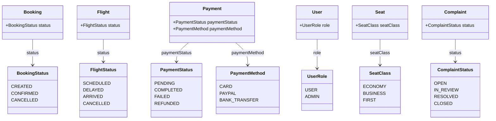
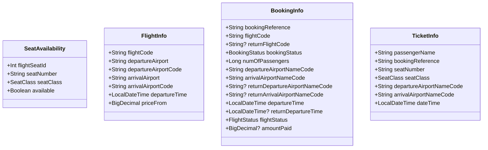
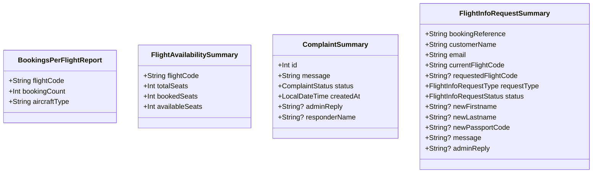
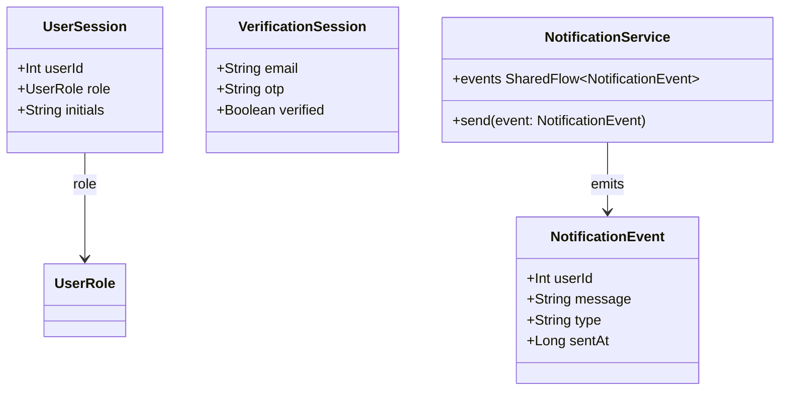
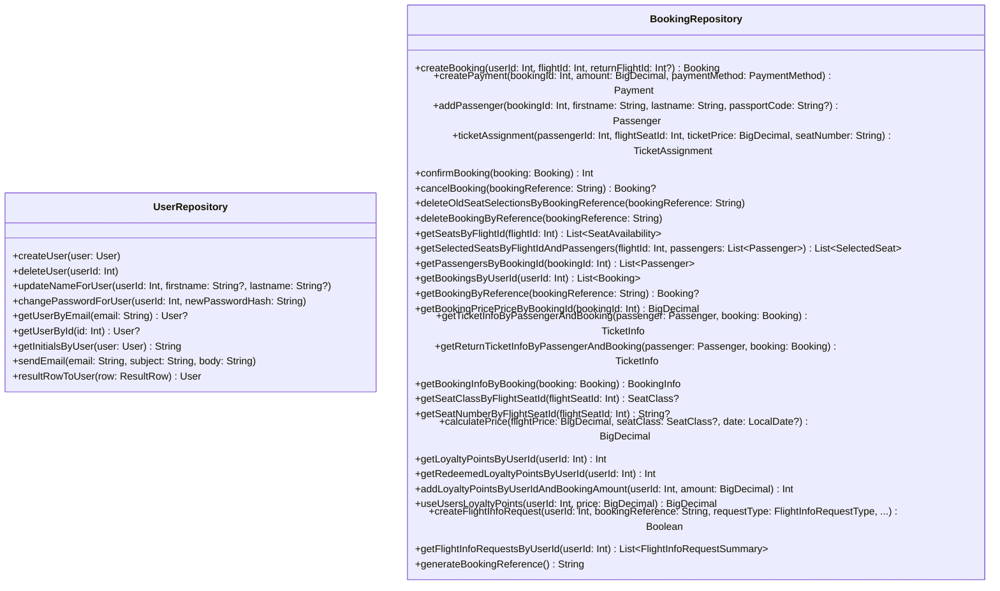
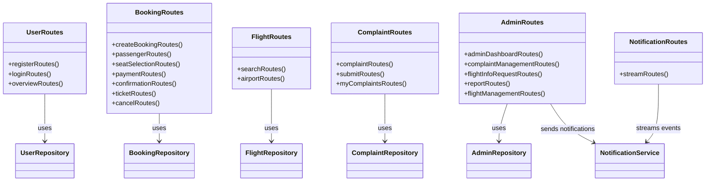
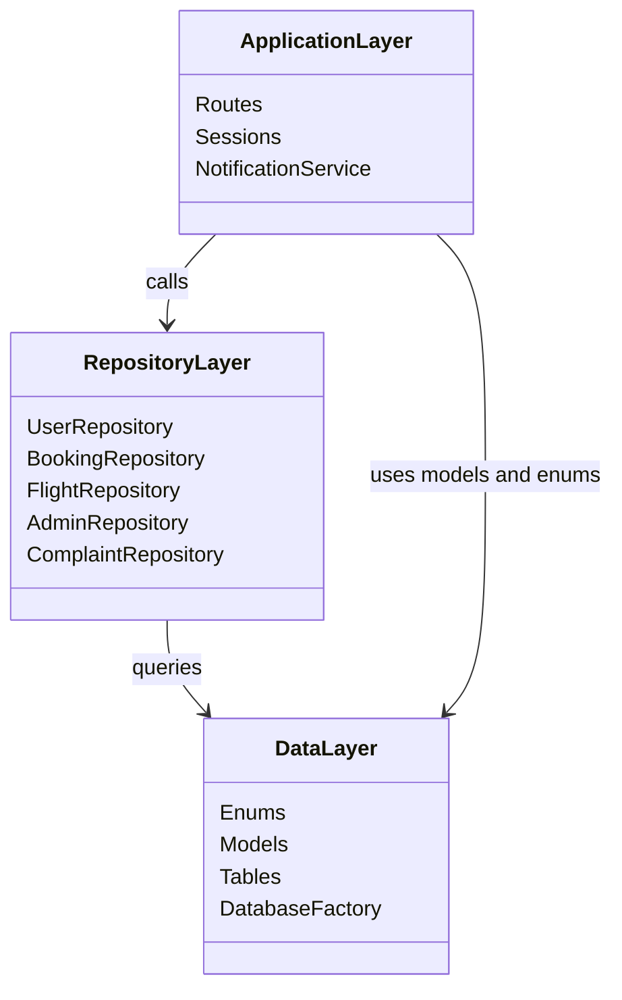

# Aero Flow — Class Diagrams

---

## Diagram 1: Enumerations

---

## Diagram 2: Core Data Models

---

## Diagram 3: Core Models and Enum Dependencies

---

## Diagram 4a: Response / DTO Models (Flight and Booking)

---

## Diagram 4b: Response / DTO Models (Reports and Requests)

---

## Diagram 5: Sessions and Notification Service

---

## Diagram 6a: Repositories (User and Booking)

---

## Diagram 6b: Repositories (Flight, Admin and Complaint)

```mermaid
classDiagram
    class FlightRepository {
        +searchFlights(fromCodes: List~String~, toCodes: List~String~, departureDate: LocalDate, numPassengers: Int, departureFlexibility: Int) List~FlightInfo~
        +getAirportById(id: Int) Airport?
        +getFlightByFlightCode(flightCode: String) Flight?
        +getFlightByFlightId(flightId: Int) Flight?
        +getAirportBySearch(search: String) List~Airport~
        +resultRowToAirport(row: ResultRow) Airport
        +resultRowToFlight(row: ResultRow) Flight
    }

    class AdminRepository {
        +getBookingsPerFlightReport() List~BookingsPerFlightReport~
        +getBookingsPerFlightByFlightCode(flightCode: String) BookingsPerFlightReport?
        +getMostPopularRoutesReport() List~PopularRouteReport~
        +getPeakBookingTimesReport() List~PeakBookingTimeReport~
        +getFlightAvailabilityReport() List~FlightAvailabilitySummary~
        +getCancelledBookings(startDate: LocalDate?, endDate: LocalDate?) List~Booking~
        +getCancelledFlights(startDate: LocalDate?, endDate: LocalDate?) List~Flight~
        +updateFlightSchedule(flightId: Int, ...)
        +updateFlightStatus(flightId: Int, newStatus: FlightStatus)
        +getAllFlightChanges(startDate: LocalDate?, endDate: LocalDate?, flightCode: String?) List~FlightChangeLog~
        +getAllFlightInfoRequests() List~FlightInfoRequestSummary~
        +approveFlightInfoRequest(requestId: Int, handledByUserId: Int, adminReply: String?)
        +rejectFlightInfoRequest(requestId: Int, handledByUserId: Int, adminReply: String)
    }

    class ComplaintRepository {
        +createComplaint(userId: Int, message: String) Int
        +getComplaintsByUserId(userId: Int) List~Complaint~
        +getAllComplaints() List~ComplaintSummary~
        +getComplaintById(complaintId: Int) Complaint?
        +updateComplaintStatus(complaintId: Int, status: ComplaintStatus)
        +handleComplaint(complaintId: Int, adminReply: String, repliedByUserId: Int)
        +resultRowToComplaint(row: ResultRow) Complaint
    }
```

---

## Diagram 7: Routes and Their Repository Dependencies

---

## Diagram 8: Full Architecture — Layer Dependencies

